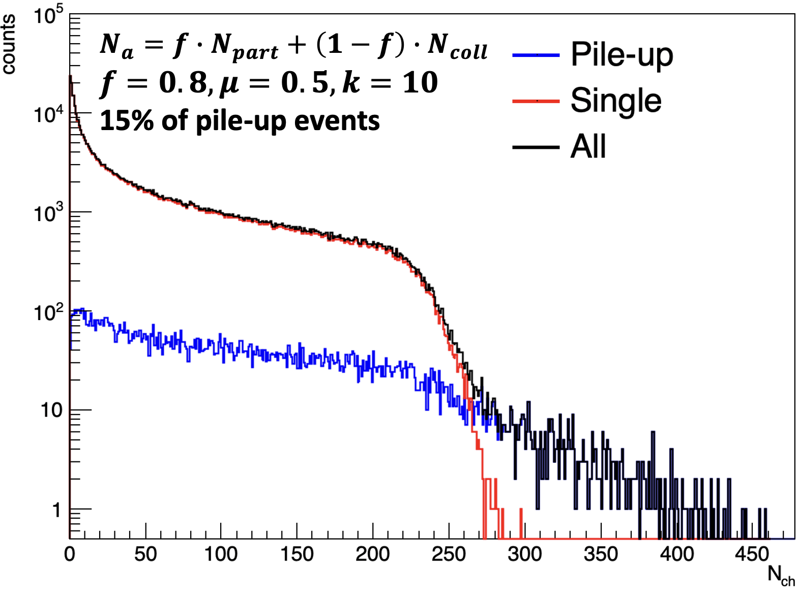

# McPileUp

A simple toy model to simulate multiplicity with pile-up using MC-Glauber information



## Requirements

- C++14 or newer
- ROOT ver. 6.20 or newer with MathMore library

## Installation

```
cd McPileUp
mkdir build && cd build
cmake ..
make
```

## Usage

``./runMc config.c``

Here `config.c` is a simple ROOT macro where all necessary parameters are set.
An example of such macro: `McPileUp/config.c`

The required parameters are as follows:
- file name for the input MC-Glauber file.
- name of the TTree (or TNtuple) in the input file.
- number of events (can be set as -1 or N). If -1 is set, the procedure will run over all events available in the input Mc-Glauber file
- Parameters to construct multiplicity from Npart and Ncoll: f, mu, k.
- Pile-up parameter p. It is the percentage of pile-up events: p=1. means 100% of events are pile-up events, p=0. means 0% of events are pile-up events.
- Function for Nancestors. One can set any function with the following arguments: `func(double f, double Npart, double Ncoll)`. See further explanation in the `config.c`.
